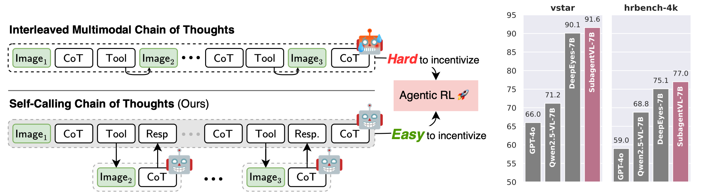
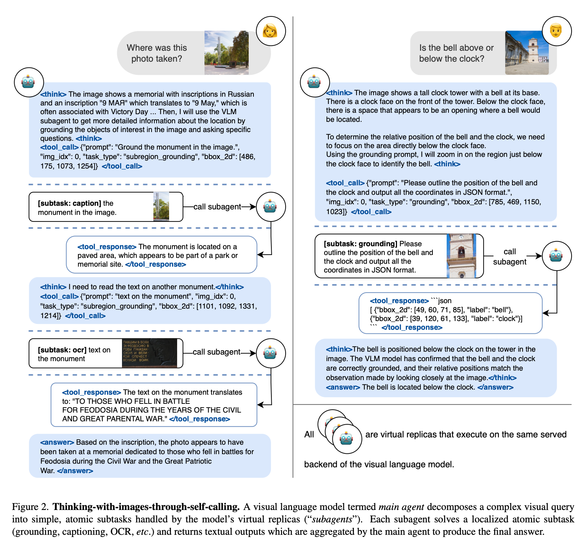

<h1 style="text-align: center;">Thinking with Images via Self-Calling Agent
</h1>
<div align="center">
<a href="https://huggingface.co/papers/2512.08511">
    
</a>
<a href="http://arxiv.org/abs/2512.08511">
    
</a>
</div>


## Introduction

- **Motivation:** Vanilla Thinking with Images paradigms typically use an interleaved Multimodal CoT (iMCoT). It is a powerful but inefficient and difficult paradigm to incentivize as it requires LLMs to reason across modalities.
- **Method:** we propose **Self-Calling Chain-of-Thought (sCoT)**, a novel visual reasoning paradigm that reformulates iMCoT as a language-only CoT with **self-calling**. 
    - Specifically, a main agent decomposes the complex visual reasoning task to atomic subtasks and invokes its virtual replicas, i.e. parameter-sharing subagents, to solve them in isolated context. 
    - sCoT enjoys substantial training effectiveness and efficiency, as it requires no explicit interleaving between modalities.


-  sCoT employs group-relative policy optimization to reinforce effective reasoning behavior to enhance optimization. Experiments on HR-Bench 4K show that sCoT improves the overall reasoning performance by up to 1.9% with ∼75% fewer GPU hours compared to strong baseline approaches.


## Installation

> [!NOTE]
> This project is developed on top of **`verl@0.5.0.dev`** and the **DeepEyes** training recipe.

We use **`uv`** to set up the environment, though using `conda` or `pip` follows a similar procedure.

```bash
# create and activate environment
uv venv --python=3.12
source .venv/bin/activate

# install PyTorch (CUDA 12.8)
uv pip install torch==2.7.1 torchvision==0.22.1 torchaudio==2.7.1 \
    --index-url https://download.pytorch.org/whl/cu128

# install verl with the sglang specification
uv pip install -e .[sglang]

# additional dependencies
uv pip install debugpy==1.8.0 flash-attn==2.8.3 \
    torch-memory-saver==0.0.9 \
    qwen-vl-utils==0.0.14 \
    qwen-agent==0.0.31
```

A full dependency list is provided in [`requirements_subagent.txt`](./requirements_subagent.txt) for reference.

## Reproduce the experiments

### End-to-End RL Training 

- We provide the training scripts to reproduce the training process in [recipe](./recipe/vlm_subagent/).
- The implementation of subagent calling is following the implementation of tools such as `image_zoom_in_tool`. Please see the implementation in [`vlm_subagent_tool`](./verl/tools/vlm_subagent_tool.py).
- We use training data collected by DeepEyes for fair comparison, which could be downloaded from [huggingface](https://huggingface.co/datasets/ChenShawn/DeepEyes-Datasets-47k).
- We conducted experiments on a single 8xA100 node: one used to serve the LLM-as-a-Judge model (another Qwen2.5-VL-Instruct-7B instance) and 7 used for RL training.

### Evaluation

We evaluate DeepEyes using its [official eval scripts](https://github.com/Visual-Agent/DeepEyes/tree/main/eval) and would provide the eval scripts for our models soon. 

## License

This project is released under [Apache license](LICENSE).

## Citation
If you find our work helpful, please cite us with the following:
<!-- ```
@misc{yang2025thinkingimagesselfcallingagent,
      title={Thinking with Images via Self-Calling Agent}, 
      author={Wenxi Yang and Yuzhong Zhao and Fang Wan and Qixiang Ye},
      year={2025},
      eprint={2512.08511},
      archivePrefix={arXiv},
      primaryClass={cs.CV},
      url={https://arxiv.org/abs/2512.08511}, 
}
``` -->
```
@article{yang2025thinkingimagesselfcallingagent
  title={Thinking with Images via Self-Calling Agent},
  author={Wenxi Yang and Yuzhong Zhao and Fang Wan and Qixiang Ye},
  journal={arXiv preprint arXiv:2512.08511},
  year={2025}
}
```
