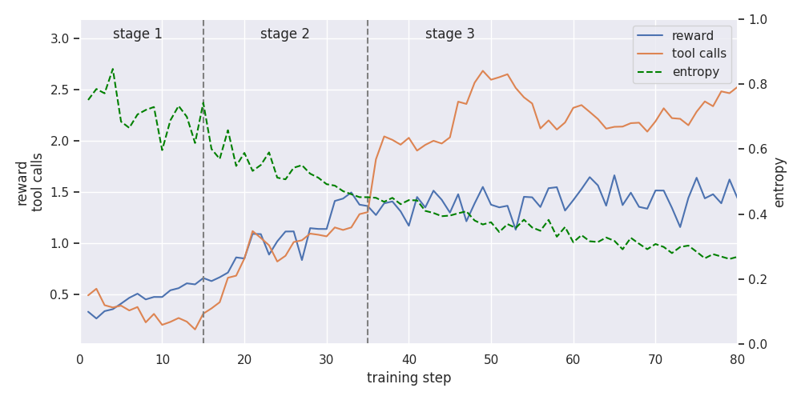

# Thinking with Images via Self-Calling Agent

This directory contains the implementation for reproducing the [Thinking with Images via Self-Calling Agent](http://arxiv.org/abs/2512.08511) paper within the verl framework, supporting multi-turn visual tool calls. This implementation is based on the original [DeepEyes paper](https://arxiv.org/abs/2505.14362) and its [official implementation](https://github.com/Visual-Agent/DeepEyes), integrated with the multi-modal and multi-turn capabilities of the verl framework.

## Reproducing the Experiment

> [!NOTE]
> We are using data curated by [DeepEyes](https://arxiv.org/abs/2505.14362). There some notes commented in its official [recipe](https://github.com/volcengine/verl/tree/main/recipe/deepeyes).

First, launch an inference service to act as a judge for reward calculation. You can use the following script as a reference:

```bash
python -m sglang.launch_server --model-path /path/to/Qwen2.5-72B-Instruct \
    --port 18901 \
    --tp-size 1 \
    --context-length 32768 \
    --trust-remote-code \
    --log-requests false
```

Next, you can start the training:

```bash
bash recipe/vlm_subagent/run_vlm_subagent_grpo.sh
```

## Training Dynamics



<!-- Note: num_tool_calls = num_turns / 2 - 1. -->

## References and Acknowledgements
- [Thinking with Images via Self-Calling Agent](http://arxiv.org/abs/2512.08511)
- [Recipe for DeepEyes](https://github.com/volcengine/verl/tree/main/recipe/deepeyes)

---
If you need further details for reproduction or encounter any issues, feel free to open an issue or contact the maintainers. 